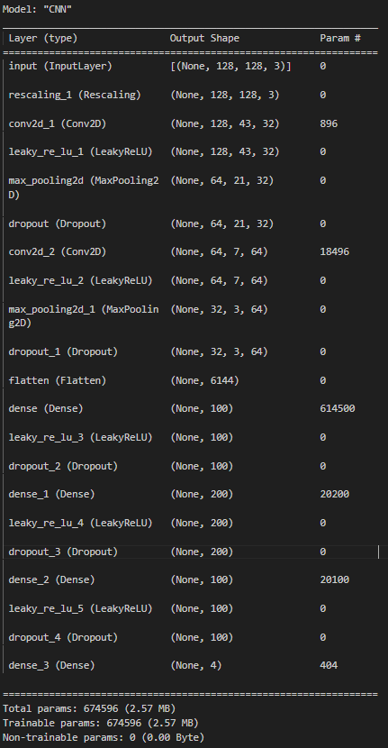

# SoundClassification

# Sustav za klasifikaciju abnormalnih respiratornih zvukova

Razvijeni sustav je Python modul namijenjen klasifikaciji respiratornih zvukova ovisno o prisutnosti abnormalnih zvukova. Cilj sustava je primjena u telemedicinskoj opremi, npr. digitalni stetoskop, kojim bi se snimljeni respiratorni zvukovi odmah klasificirali radi ranije uspostave dijagnoze i liječenja. 
Respiratorni zvukovi dijele se u 4 klase: crackles (zvukovi pucketanja), wheezes (zvukovi zviždanja), both (zvukovi pucketanja i zviždanja) i normal (normalno disanje). 
Kao ulazni parametar u sustav se šalje putanja do respiratorne zvučne snimke, bilo iz memorije računala ili sa servera. Na izlazu se ispisuju predviđene klase po segmentima iz snimke.

## Instalacija
Prije korištenja sustava treba importati AudioClassification Python modul. 

```python 
from AudioClassification import *
```
Korišteni dependencies su: 
```
from pydub import AudioSegment
import numpy as np
import pandas as pd
import matplotlib.pyplot as plt
from scipy.io import wavfile
from io import BytesIO
from PIL import Image
import os
import wave
import tensorflow as tf
from tensorflow import keras
from keras import backend as K
from sklearn.model_selection import ShuffleSplit
import logging
import pathlib
import librosa
from gammatone import gtgram
from gammatone import filters
import librosa.display
from scipy import signal
from gammatone import fftweight
import cv2
import requests
import tempfile
from urllib.request import urlopen
```
## Korištenje
Ulazni parametar za sustav je putanja do zvučnog zapisa u memoriji 
```
p = "C:/Users/Meter/Desktop/tomo_diplomski/ICBHI_final_database/130_1p3_Ll_mc_AKGC417L.wav"
```

ili raw URL za zapis sa servera. Na kraju URL-a potrebno je dodati ?raw=true.
```
p = "https://github.com/ivonagrbesadragun/AudioFiles/blob/master/101_1b1_Al_sc_Meditron.wav?raw=true"
```

Pozivom metode Classify kojoj se prosljeđuje putanja pokreće se klasifikacija zvukova po manjim segmentima iz snimke.

```
Classify(p)
```

Predviđene klase ispisuju se za svaki od segmenata: 


## Pojedinosti o sustavu
Klasifikacijski sustav radi na temelju konvolucijske neuronske mreže. Ulaz u konvolucijsku mrežu je slika - spektrogram, dobiven primjenom gamaton filtera na zvučni signal, s ciljem da se što bolje oponaša ljudsko uho.


Arhitektura korištene konvolucijske neuronske mreže prikazana je na sljedećoj slici. 


U svrhu boljeg učenja mreže dodani su Dropout i Max Pooling slojevi te je definiran Callback od 10 epoha. 

Dataset na kojem je trenirana mreža dobiven je iz javne baze respiratornih zvukova ICBHI 2017 Challenge. Iz svakog zvučnog zapisa izrezuju se segmenti od 500 ms s 25% preklapanja, koji se primjenom gamaton filtera pretvaraju u slike. Dobiveni dataset ima 65494 slika, svaka je dimenzije 128 x 128 s 3 kanala boje. Na sljedećoj slici dan je primjer spektrograma za zvučni zapis iz klase normal. 


Treniranje se provodilo na slučajno izabranim podskupovima od po 1536 elemenata, pri čemu je validacijski split 25%. Korištena funkcija gubitka je Sparse Categorical Crossentropy, promatrana metrika Sparse Categorical Accuracy, a optimizator Adam uz stopu učenja 0.001. 

Ovakav model postiže razinu performansi od 66% točnosti na skupu za testiranje. 

